# 🏢 OMVEXORX Technologies Private Limited

### 🚀 Building the Technologies of Tomorrow

---

**Frameworks • Libraries • Developer Tools • IDE • Website Builder • Software • Games • AI • Platforms • Open Source • Research**

---

## 📌 Table of Contents

- [🚀 Next-Generation Technology](#-next-generation-technology)
- [🌐 About OMVEXORX](#-about-omvexorx)
- [🏗️ OMVEXORX Technology Ecosystem](#%EF%B8%8F-omvexorx-technology-ecosystem)
- [🧩 Frameworks](#-frameworks)
- [📚 Libraries \& Packages](#-libraries--packages)
- [💻 Code Editor \& IDE](#-code-editor--ide)
- [🌐 Website Builder](#-website-builder)
- [🖥️ Software Development](#%EF%B8%8F-software-development)
- [🎮 Game Development](#-game-development)
- [🔌 APIs \& SDKs](#-apis--sdks)
- [🛠️ Developer Tools](#%EF%B8%8F-developer-tools)
- [🤖 AI \& Automation](#-ai--automation)
- [☁️ Cloud \& Backend Technologies](#%EF%B8%8F-cloud--backend-technologies)
- [🧪 Research \& Experimental Technologies](#-research--experimental-technologies)
- [🌍 Open Source vs 🔐 Proprietary Technologies](#-open-source-vs--proprietary-technologies)
- [📦 Repository Categories](#-repository-categories)
- [🌱 Our Vision \& 🎯 Mission](#-our-vision--mission)
- [📜 Licensing \& 🤝 Contributing](#-licensing--contributing)
- [🌐 Official Websites](#-official-websites)
- [⚠️ Important Notice](#%EF%B8%8F-important-notice)

---

## 🚀 Next-Generation Technology

Welcome to **OMVEXORX Technologies Private Limited**.

OMVEXORX is a technology company focused on building **Next-Generation Technology** across software development, developer tools, frameworks, libraries, platforms, applications, games, AI, and other areas of modern technology.

We are not limited to one programming language, framework, platform, or technology ecosystem.

Our goal is to research, design, engineer, and build our own technologies that developers, creators, businesses, and users can use to create the next generation of digital products.

> **Next-Generation Technology** is the core idea behind OMVEXORX. We are interested in technologies that can improve the way software is created, developed, deployed, and experienced. We don't want to be limited to what already exists — we want to explore what can be built next.

---

## 🌐 About OMVEXORX

OMVEXORX focuses on building technology from the ground up.

We develop and explore:

- 🚀 **Next-Generation Technology**
- 🧩 **Frameworks**
- 📚 **Libraries & Packages**
- 💻 **Code Editors & IDEs**
- 🛠️ **Developer Tools**
- 🌐 **Website Builders**
- 🖥️ **Software Applications**
- 📱 **Mobile Applications**
- ☁️ **Cloud & Backend Technologies**
- 🔌 **APIs & SDKs**
- 🤖 **AI & Automation**
- 🎮 **Game Development**
- 🧪 **Research & Experimental Technologies**
- 🌍 **Selected Open-Source Projects**
- 🔐 **Proprietary Technologies**
- 📦 **Software Platforms & Products**

Our work spans multiple programming languages, operating systems, platforms, and technology ecosystems.

---

## 🏗️ OMVEXORX Technology Ecosystem

```mermaid
graph TD
    A["OMVEXORX<br/>Next-Generation Technology"]

    A --> B["Frameworks"]
    A --> C["Libraries & Packages"]
    A --> D["Developer Tools"]
    A --> E["Code Editor & IDE"]
    A --> F["Website Builder"]
    A --> G["Software Development"]
    A --> H["Game Development"]
    A --> I["APIs & SDKs"]
    A --> J["AI & Automation"]
    A --> K["Cloud & Backend"]
    A --> L["Research & Experimental Technology"]
    A --> M["Selected Open-Source Projects"]
    A --> N["Proprietary Technologies"]

    B --> B1["Web"]
    B --> B2["Backend"]
    B --> B3["Frontend"]
    B --> B4["Desktop"]
    B --> B5["Mobile"]
    B --> B6["Game"]

    C --> C1["Modules"]
    C --> C2["Packages"]
    C --> C3["Components"]
    C --> C4["Developer Libraries"]

    D --> D1["CLI Tools"]
    D --> D2["Build Tools"]
    D --> D3["Testing"]
    D --> D4["Debugging"]
    D --> D5["Automation"]

    E --> E1["Code Editing"]
    E --> E2["Code Completion"]
    E --> E3["Debugging"]
    E --> E4["Extensions"]
    E --> E5["Multi-Language Support"]

    F --> F1["Visual Builder"]
    F --> F2["Templates"]
    F --> F3["Components"]
    F --> F4["Publishing & Deployment"]

    G --> G1["Web"]
    G --> G2["Desktop"]
    G --> G3["Mobile"]
    G --> G4["Cloud"]
    G --> G5["SaaS"]

    H --> H1["Games"]
    H --> H2["Game Frameworks"]
    H --> H3["Game Tools"]
    H --> H4["Game Technologies"]

    I --> I1["APIs"]
    I --> I2["SDKs"]
    I --> I3["Client Libraries"]
    I --> I4["Integrations"]

    J --> J1["AI Applications"]
    J --> J2["AI Developer Tools"]
    J --> J3["Automation"]
    J --> J4["AI APIs"]

    K --> K1["Backend"]
    K --> K2["Cloud Services"]
    K --> K3["Infrastructure"]
    K --> K4["Deployment"]

    L --> L1["Research"]
    L --> L2["Prototypes"]
    L --> L3["Experiments"]
    L --> L4["Proof of Concepts"]

    M --> M1["Open-Source Frameworks"]
    M --> M2["Open-Source Libraries"]
    M --> M3["Open-Source Tools"]

    N --> N1["Commercial Software"]
    N --> N2["Private Source Code"]
    N --> N3["Internal Technologies"]
    N --> N4["Unreleased Products"]
```

---

## 🧩 Frameworks

One of the major areas of OMVEXORX is the development of our own frameworks across different technology ecosystems and use cases.

Our framework development covers:
- **Web Frameworks** — Foundations for modern web architectures
- **Backend Frameworks** — High-performance server runtime and routing layers
- **Frontend Frameworks** — Dynamic UI component frameworks
- **Application Frameworks** — Multi-platform application scaffolding
- **Desktop Frameworks** — Native and cross-platform desktop UI solutions
- **Mobile Frameworks** — Highly responsive mobile app foundations
- **API Frameworks** — Microservice and REST/GraphQL framework tools
- **Game-Development Frameworks** — Rendering and game loop abstractions
- **Specialized & Developer Frameworks** — Tailored solutions for workflow optimizations

---

## 📚 Libraries & Packages

Frameworks are only one part of a software ecosystem. We develop reusable building blocks that make software development easier and more productive:

- **Libraries & Packages** — Modular components for targeted functionalities
- **Modules & Utilities** — Zero-dependency helper modules
- **UI & System Components** — Production-ready building blocks
- **Developer APIs** — Standardized interfaces for integration

Our libraries can be used independently or together with OMVEXORX frameworks and platforms.

---

## 💻 Code Editor & IDE

OMVEXORX is working toward building its own modern developer environment designed to support developers while writing, testing, debugging, managing, and building software:

- 📝 **Source-code editing** & Advanced syntax highlighting
- 🧠 **Intelligent code completion** & AI assistance
- 🐞 **Integrated Debugging** & Diagnostic profiling
- 🧩 **Extensions & Plugin System**
- 💻 **Integrated Terminal** & Shell environment
- 📂 **Project Management** & Version-control integration
- 🌐 **Multi-language support** & Cross-platform build tools

---

## 🌐 Website Builder

Our website-building technology makes it seamless to create websites and web applications while preserving complete custom-code freedom:

- **Visual Website Building** — Drag-and-drop interface design
- **Templates & Components** — Curated, responsive layout libraries
- **Custom Code Integration** — Full developer access to underlying codebases
- **Publishing & Instant Deployment** — Automated cloud hosting pipeline
- **Extensible Architecture** — Third-party plugin & API ecosystem

---

## 🖥️ Software Development

Software development is a major pillar at OMVEXORX. We engineer software across multiple platforms and domains:

- **Web & Cloud Applications**
- **Desktop & Native Software**
- **Mobile Applications (iOS & Android)**
- **SaaS Products & Enterprise Software**
- **Developer Productivity & Utility Tools**

---

## 🎮 Game Development

OMVEXORX explores game development and related technologies:

- **Interactive Games** across platforms
- **Game Engines & Frameworks**
- **Developer Utilities & Assets**
- **Experimental Interactive Graphics**

---

## 🔌 APIs & SDKs

OMVEXORX develops APIs, SDKs, client libraries, and integration tools to empower developers:

- **REST & GraphQL APIs**
- **Multi-language Developer SDKs**
- **CLI Integrations**
- **Third-party System Connectors**

Each API/SDK comes with standard versioning, comprehensive documentation, and flexible licensing terms.

---

## 🛠️ Developer Tools

We engineer standalone and integrated developer tooling to optimize workflows:

- **CLI & Project Generators**
- **Build & Compilation Tools**
- **Automated Testing & Debugging Utilities**
- **Package Management & Deployment Tooling**

---

## 🤖 AI & Automation

Artificial Intelligence and automation drive the future of our software ecosystem:

- **AI-Powered Applications & Assistants**
- **Intelligent Developer Tooling**
- **Automation Workflows & Agents**
- **AI Infrastructure & API Integrations**

---

## ☁️ Cloud & Backend Technologies

Robust backend infrastructure supporting scaling applications:

- **Backend Architecture & Distributed Systems**
- **Cloud Services & Managed Databases**
- **Authentication & Security Services**
- **CI/CD Infrastructure & Deployment Pipelines**

---

## 🧪 Research & Experimental Technologies

We foster innovation through dedicated research:

- **Experimental Frameworks & Architectures**
- **Prototypes & Proofs of Concept**
- **Technology Demos & Feasibility Studies**

---

## 🌍 Open Source vs 🔐 Proprietary Technologies

OMVEXORX supports open-source software to empower the broader developer community while maintaining proprietary technologies for commercial products:

> 💡 **Notice:** Not all OMVEXORX source code is open source. Repositories will explicitly specify their license terms.

- **Open Source:** Frameworks, utilities, developer tools, libraries, and selected research.
- **Proprietary:** Enterprise software, internal platforms, commercial APIs, and core algorithms.

---

## 📦 Repository Categories

| Category | Description |
| --- | --- |
| 🧩 **Frameworks** | Frameworks and development platforms |
| 📚 **Libraries** | Libraries, packages, modules, and components |
| 💻 **IDE / Editor** | Code editors and development environments |
| 🛠️ **Developer Tools** | Tools for software development |
| 🌐 **Web** | Web technologies and website tools |
| 📱 **Mobile** | Mobile applications and technologies |
| 🖥️ **Desktop** | Desktop software and technologies |
| 🎮 **Games** | Games and game-development technologies |
| 🔌 **APIs / SDKs** | APIs, SDKs, and integrations |
| 🤖 **AI** | AI and automation technologies |
| ☁️ **Cloud** | Cloud and backend technologies |
| 🧪 **Research** | Experimental and research projects |
| 🌍 **Open Source** | Selected open-source projects |
| 🔒 **Proprietary** | Private or closed-source technologies |
| 📖 **Documentation** | Documentation, guides, and examples |

---

## 🌱 Our Vision & 🎯 Mission

### 🌱 Vision
To create an ecosystem where frameworks, libraries, developer tools, IDEs, software platforms, and AI technologies seamlessly integrate, enabling developers and non-developers alike to build lasting technology products.

### 🎯 Mission
To research, design, engineer, and build **Next-Generation Technology** that advances the state of software development across global ecosystems.

---

## 📜 Licensing & 🤝 Contributing

### 📜 Licensing
Every repository in the OMVEXORX organization maintains its own specific license. Always consult the repository's `LICENSE` file for permissions regarding commercial use, modification, and distribution.

### 🤝 Contributing
We welcome contributions to open-source repositories! Please review the `CONTRIBUTING.md` guide within individual repositories for pull request guidelines, code of conduct, and submission standards.

---

## 🌐 Official Websites

- 🌐 **Official Website:** [https://OMVEXORX.in](https://OMVEXORX.in)
- 🌎 **Global Website:** [https://OMVEXORX.com](https://OMVEXORX.com)
- 🐙 **GitHub Organization:** [https://github.com/OMVEXORX](https://github.com/OMVEXORX)

---

## ⚠️ Important Notice

Projects published by OMVEXORX vary by development stage, license, supported platform, and stability. A project may be production-ready, under active development, experimental, or archived. Always reference project documentation prior to deployment.

---

### 🏢 OMVEXORX Technologies Private Limited
*Building the Technologies of Tomorrow.*

© OMVEXORX Technologies Private Limited. All rights reserved where applicable.

